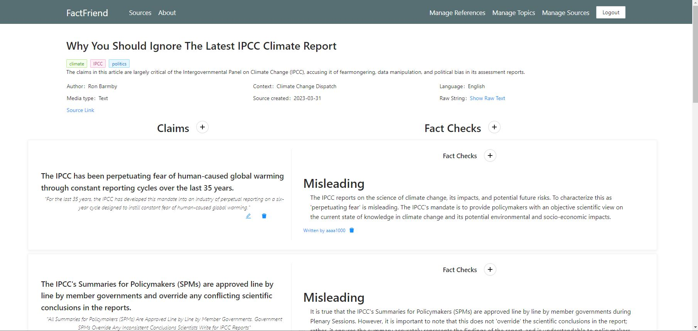

# gpt-fact-checker: FactFriend
FactFriend is a project aiming to make fact checking easier. It is a platform where users can view sources, the claims made by the source, and fact checks for each claim.

## Sources

Sources can be videos, news articles, podcasts or anything. 
A source is displayed with all claims it makes listed.
Users can register claims made by source manually or automatically from the raw text.
Raw text can automatically be extracted from certain supported sources.

## Claim Extraction
FactFriend can extract claims made by a source automatically by using OpenAI's GPT API, listing claims made.

## Fact Checking
FactFriend can fact check based on topics for each source and claim by using OpenAI's GPT API and provided topics.

# Tech Stack
Frontend: Vue 3 with TypeScript
Backend: C#
External services:  OpenAI GPT API, OpenAI Whisper API

# License
This project is licensed under the MIT License.
